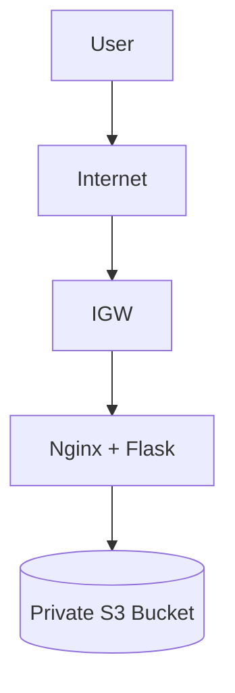

# 📂 Document Management System (AWS)

A **secure and scalable cloud-based document management system** built using AWS.
It handles file uploads via a **Flask app on EC2**, stores them in a **private S3 bucket**, and uses **Nginx** for web serving.

---

Architecture



---

Overview

* Custom **VPC (10.0.0.0/16)** with public subnet
* EC2 (`t2.micro`) hosts **Flask + Nginx**
* Users upload files → stored securely in **S3**
* IAM ensures secure access

---

Features

* Secure file upload system
* Private S3 storage
* Nginx reverse proxy
* AWS VPC networking
* Lightweight & cost-efficient (Free Tier)

---

Tech Stack

AWS VPC • EC2 • S3 • Python Flask • Nginx • Linux • SSH

---

Setup (Quick Steps)

1. VPC & Network

* VPC: `10.0.0.0/16`
* Public Subnet: `10.0.1.0/24`
* Internet Gateway attached
* Route: `0.0.0.0/0 → IGW`

---

2. EC2 Instance

* AMI: Amazon Linux
* Type: `t2.micro`
* Public IP enabled
* Security Group:

  * SSH (22)
  * HTTP (80)

---

3. Connect to EC2

```bash
chmod 400 key.pem
ssh -i key.pem ec2-user@<PUBLIC_IP>
```

---

4. Install Dependencies

```bash
sudo yum update -y
sudo yum install python3 nginx -y
pip3 install flask boto3
```

---

5. Run Flask App

```python
from flask import Flask, request
import boto3

app = Flask(__name__)
s3 = boto3.client('s3')
BUCKET = "your-bucket-name"

@app.route('/upload', methods=['POST'])
def upload():
    file = request.files['file']
    s3.upload_fileobj(file, BUCKET, file.filename)
    return "Uploaded"

app.run(host='0.0.0.0', port=80)
```

```bash
sudo python3 app.py
```

---

6. S3 Setup

* Create bucket (private)
* Enable block public access
* Use default encryption

---

Testing

Create `upload.html`:

```html
<form action="http://<PUBLIC_IP>/upload" method="post" enctype="multipart/form-data">
  <input type="file" name="file">
  <input type="submit" value="Upload">
</form>
```

* Open in browser
* Upload file
* Verify in S3

---

Workflow

```
User → EC2 (Nginx) → Flask → S3 → Response
```

---

Troubleshooting

* Nginx not working → `sudo systemctl status nginx`
* Flask not running → check process
* Upload fails → verify S3 + IAM

---

Improvements

* Load Balancer + Auto Scaling
* HTTPS (SSL)
* Docker & Kubernetes
* CI/CD pipeline

---

Resume Value

* AWS Architecture (VPC, EC2, S3)
* Backend Deployment (Flask)
* Reverse Proxy (Nginx)
* Secure Cloud Storage

---

